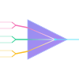

# Catalyst: A Declarative Build System for C/C++



## Introduction

Catalyst is a declarative meta build system for C and C++ that reimagines project configuration and dependency management around clarity, determinism, and reproducibility.

Designed to be simple yet powerful, Catalyst emphasizes per-target isolation, clean YAML-based configuration, and strict reproducibility guarantees by default. Unlike traditional tools like CMake or Autotools, Catalyst avoids ad hoc scripting and imperative logic, favoring profiles, feature flags, and an extensible schema that aligns with modern systems programming practices.

## Features

- 📦 **Declarative Targets** — Each target is specified independently using a clean, readable `catalyst.yaml`.
- 🎯 **Single-Target Output** — Each directory maps to one target; complex projects are composed via directory layout.
- 🔁 **Reproducibility First** — Deterministic builds with minimal external assumptions.
- 🔧 **Feature Flags** — Compile-time options toggled via a `features` field.
- 📁 **Profile Composition** — Reuse and extend common settings declaratively through named profiles.
- 🌍 **Cross-Compilation Ready** — Designed with toolchain switching and target platform isolation in mind.
- ⛓️ **Git-Based Dependency Resolution** — Projects are fetched directly from source with minimal overhead.
- 🧪 **First-Class Testing Support** — Integration with lightweight test frameworks and custom test runners.

## Configuration

Each project contains a top-level `catalyst.yaml` that describes a single target. For example:

```yaml
manifest:
  name: catalyst
  version: 0.1.0
  type: BINARY
  description: A declarative build system for Modern C++.
  tooling:
    CC: clang
    CCFLAGS: -Wall -Werror -Wextra -Wpedantic
    CXX: clang++
    CXXFLAGS: -Wall -Werror -Wextra -Wpedantic
  provides: catalyst
  dirs:
    include:
      - include
    source:
      - src
      - src/subcommand_actions
    build: build
dependencies:
  yaml-cpp:
    version: latest
    profile: ""
    source: catalyst_hub
    using:
      []
```

Targets are built in isolation, and can inherit settings via "profiles" for
reuse. Feature toggles enable preprocessor definitions, supporting composable
and readable builds.

## Docs

Documentation can be found [here](./DOCS.md) or by running `catalyst help`.

## Acknowledgements

Catalyst is very heavily inspired by the following projects:

- [Cargo](https://github.com/rust-lang/cargo)
- [Ninja](https://ninja-build.org/)
- [vcpkg](https://vcpkg.io/en/)

Catalyst also depends on the following libraries:

- [yaml-cpp](https://github.com/jbeder/yaml-cpp)
- [CLI11](https://github.com/CLIUtils/CLI11)

## Contributors

- Maintainer: [Siddharth Mohanty](https://www.linkedin.com/in/siddharth---mohanty)
